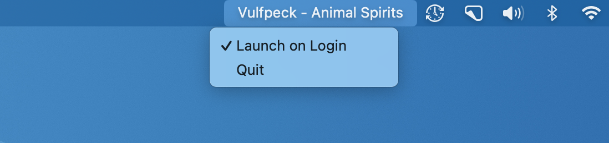

# NowPlayingMenuBar

⚠️ **Project status:** No longer functional or maintained.

This was an experiment in using the `MediaRemote` framework to show what's currently now playing. `MediaRemote` has the advantage of working across all apps that play media, rather than requiring specific hooks for individual apps. Unfortunately, `MediaRemote` is a private framework that isn't officially supported by Apple, and as of macOS 15.4 the APIs this app uses to communicate with it no longer appear to work at all.

If you want a free, minimalist app to show you what song is currently playing in the menu bar, [menubar-ticker](https://github.com/serban/menubar-ticker) works great. If you want something a little fancier, [Tuneful](https://www.tuneful.dev) is a great paid option with tons of features, including a slick notch integration. Sadly, both apps (like most in this category) only support Apple Music and Spotify, due to Apple's lack of official APIs for detecting what's playing at the OS level.

---

See what’s playing on your Mac, right in your menu bar, 24/7. Supports any app that integrates with Apple’s “Now Playing” feature.

Requires macOS 13 (Ventura) or newer.

## Acknowledgments

* Thanks to Serban Giuroiu for creating [menubar-ticker](https://github.com/serban/menubar-ticker), which inspired this project.
* Thanks to John Coates for [Aerial](https://github.com/JohnCoates/Aerial), which the MediaRemote code in this project is adapted from.
* Thanks to Sindre Sorhus for [LaunchAtLogin-Modern](https://github.com/sindresorhus/LaunchAtLogin-Modern), which the LaunchAtLogin code in this project is adapted from.
